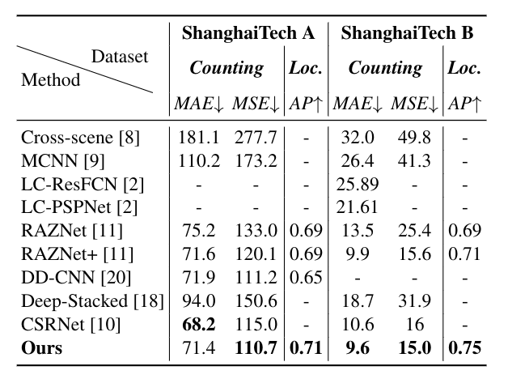

# [Multiscale Crowd Counting and Localization by Multitask Point Supervision](https://arxiv.org/abs/2202.09942)
## Abstract:
We propose a multitask approach for crowd counting and person localization in a unified framework. As the detection and localization tasks are well-correlated and can be jointly tackled, our model benefits from a multitask solution by learning multiscale representations of encoded crowd images, and subsequently fusing them. In contrast to the relatively more popular density-based methods, our model uses point supervision to allow for crowd locations to be accurately identified. We test our model on two popular crowd counting datasets, ShanghaiTech A and B, and demonstrate that our method achieves strong results on both counting and localization tasks, with MSE measures of 110.7 and 15.0 for crowd counting and AP measures of 0.71 and 0.75 for localization, on ShanghaiTech A and B respectively. Our detailed ablation experiments show the impact of our multiscale approach as well as the effectiveness of the fusion module embedded in our network. 

## Results:
We evaluated our method against previous crowd counting methods using MSE, MAE and AP measures. The results from the proposed method are presented below:




### Visualization:

Visualized samples of detection and localization. Yellow and red points denote detected and ground truth head locations, respectively.


## Dependencies
[PyTorch](https://pytorch.org)

This code is tested under Ubuntu 18.04, CUDA 11.2, with one NVIDIA Titan RTX GPU.
Python 3.8.8 version is used for development.


## Datasets
[ShanghaiTech](https://www.kaggle.com/tthien/shanghaitech)

To preprocess ShanghaiTech dataset:
```
python make_dateset.py
```

## To train the code:
```
python train.py
```
We also provide trained models:

[Trained models](https://queensuca-my.sharepoint.com/:f:/g/personal/hd53_queensu_ca/Ercs-ffjKR5Jj7-AhnzXfQEB10Es-Yiyl5tSkc2bM_6XPw?e=T5LgaK)


## to test the code:
```
python eval.py
```

## Citation
Please cite our paper if you use code from this repository:
```
@article{zand2022Multiscale,
  title={Multiscale Crowd Counting and Localization By Multitask Point Supervision},
  author={Zand, Mohsen, Damirchi, Haleh, Farley, Andrew, Molahasani, Mahdiyar, Greenspan, Michael, and Etemad, Ali},
  journal={IEEE International Conference on Acoustics, Speech, and Signal Processing (ICASSP), 2022.},
  year={2022}
}
```


## References
[CSRNet](https://github.com/leeyeehoo/CSRNet)
